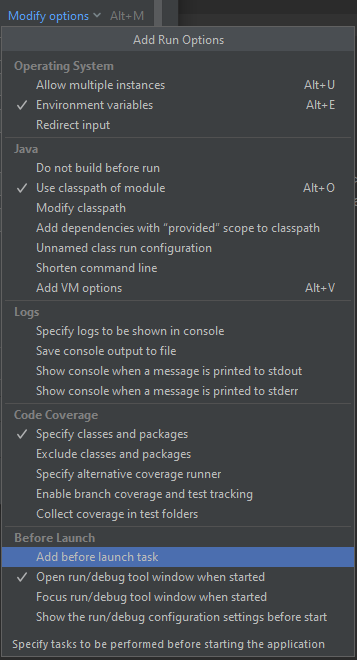
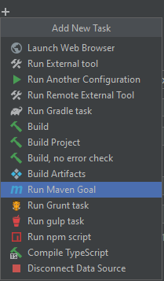

# Multiple inheritance

## Что такое Multiple inheritance

Multiple inheritance - библиотека для реализации множественного наследования в вашем коде

Имеет в себе аннотацию, указывающую, от каких классов следует отнаследоваться

```java
@MultipleInheritance(classes = {B.class, C.class, D.class})
public class A extends AIntermediary {

    public int whatever(int a) {
        System.out.println("A says " + a);
        return super.whatever(a + 1);
    }
}
```

## Для использования

### 1. Написание собственного класса
Предположим есть классы A и B с методом whatever()

```java
public class A {

    public void whatever() {
        System.out.println("It's A");
    }
}
```

```java
public class B {

    public void whatever() {
        System.out.println("It's B");
    }
}
```
Вы хотите написать класс С, который будет наследоваться от этих двух классов

Для этого над классами нужно указать аннотацию ``@MultipleInheritance()`` для родителей и потомка

```java
@MultipleInheritance
public class A {

    public void whatever() {
        System.out.println("It's A");
    }
}
```

```java
@MultipleInheritance
public class B {

    public void whatever() {
        System.out.println("It's B");
    }
}
```

```java
@MultipleInheritance(classes = {A.class, B.class})
public class С {
    
    public void whatever() {
        System.out.println("It's C");
    }
}
```

### 2. Компиляция

После запуска ``mvn clean compile`` cгенерируются классы:

- AIntermediary
- BIntermediary
- CIntermediary

### 3. Прописывание "классов-прослоек"

Для каждого класса пропишите наследование от соответствующего ему **"класса-прослойки"** и **вызов метода** ``super()``

```java
@MultipleInheritance
public class A extends AIntermediary {

    public void whatever() {
        System.out.println("It's A");
        super().whatever();
    }
}
```

```java
@MultipleInheritance
public class B extends BIntermediary {

    public void whatever() {
        System.out.println("It's B");
        super().whatever();
    }
}
```

```java
@MultipleInheritance(classes = {A.class, B.class})
public class С extends CIntermediary {
    
    public void whatever() {
        System.out.println("It's C");
        super().whatever();
    }
}
```

## Требования

- Java 17

## Maven

Пример ``pom.xml`` с зависимостью ``multiple-inheritance``

```xml
...

<properties>
    <multiple-inheritance.version>1.0.20-SNAPSHOT</multiple-inheritance.version>
</properties>

...

<dependencies>
    <dependency>
        <groupId>ru.miqqra</groupId>
        <artifactId>multiple-inheritance</artifactId>
        <version>${multiple-inheritance.version}</version>
    </dependency>
    
    ...

</dependencies>

...
```

## Gradle

Пример ``build.gradle`` с зависимостью ``multiple-inheritance``

```gradle

dependencies {

    implementation 'ru.miqqra:multiple-inheritance:1.0.20-SNAPSHOT'
    
    ...
}
...
```

## Intellij

Если вы используете Intellij, можете добавить конфигурацию сборки проекта

1. Нажмите на main и выберите ```Edit configuration```


2. Во вкладке ```Modify options``` выберите ```Add before launh task```



3. Нажмите плюсик ``Add task``


4. Выберите ``Run maven goal``



5. В новой цели пропишите ``clean``


6. Поменяйте местами стадию ``Build`` и ``Run maven goal``

